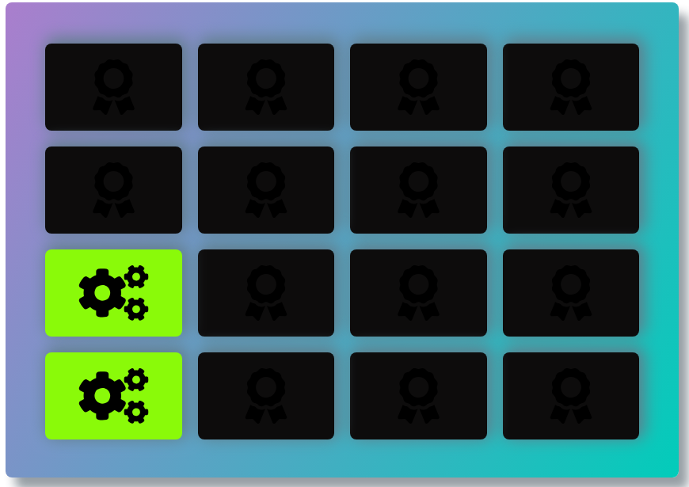

# frontend-nanodegree-card-game

This project uses Vanilla Javascript 

## Installation
Just clone the project and open the index.html in the chosen browser.

## Memory Game
Card game is a very old game Just clinck on the images to chech if the images match. The goal of this game is to test the user memory.

## Instructions

* Click on the card and it will flip.
* Keep clicking and and remember the similar card image
* Try to match cards with less moves and faster time

## About the development of the Game.

This project was developed in Vanilla JavaScript in order to manipulate the DOM.
Also used HTML and CSS3 to style the game.
